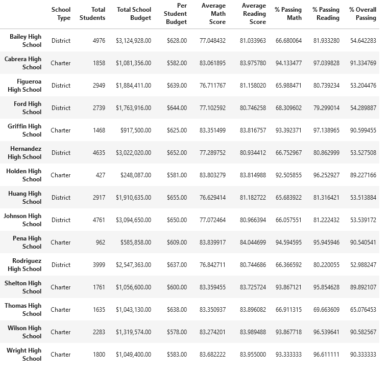

# School District Analysis

## Overview

This project uses Python and the Pandas library to perform transformation and analysis on datasets in csv format. After the data is cleaned up we group and analysze the data by different metrics to present an overview of the performance of the students in this school district.

### Purpose

The school board has been given evidence suggesting academic dishonesty. The math and reading scores for the Thomas High School ninth grade students are suspected to have been tampered with and throw into doubt the accuracy of the previous analysis. After replacing the suspect grades with NaN, the analysis needs to be repeated. 

## Results

<!-- Use bulleted lists and images of DataFrames as support, address the following questions -->
Overall the removal of the math and reading scores for the ninth grade Thomas High School students appeared to make a minimal difference in our results.

* How is the district summary affected?
\
\
It can be seen from these two data frames that the average math score and percentage passing math and reading both went down a small amount.

* How is the school summary affected?
\
\
For Thomas High School the average math score decreased by about a tenth of a point, and the average reading score increased by about a tenth of a point. The percentage passing math and reading both dropped significantly because the ninth grade scores are now NaN.

* How does replacing the ninth graders' math and reading scores affect Thomas High School's Performance relative to the other schools?
\
\
There was no change in Thomas High School's performance relative to the other schools, it was the number two school both before and after. 

* How does replaceing the ninth-grade scores affect the following:
	- Math and reading scores by grade\
	 \
	 \
	The scores stayed the same, except for Thomas High School ninth grade which is now NaN.
	- Scores by school spending\
	\
	
	Scores by school spending stayed the same.
	- Scores by school size\
	\
	
	Scores by school size stayed the same.
	- Scores by school type\
	\
	
	Scores by school type stayed the same.

## Summary

<!-- Summarize four changes in the updated school district analysis after the suspect scores have been replaced -->
